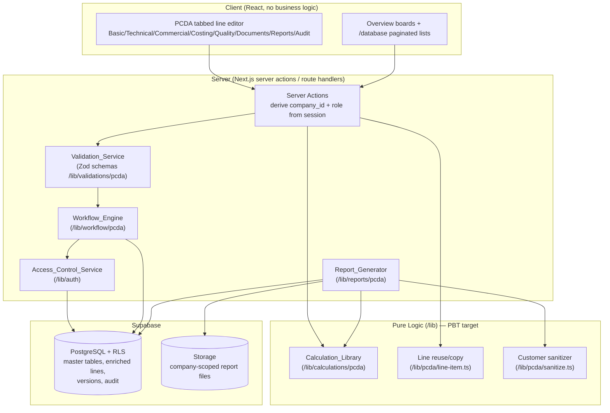

# Design Document — PCDA Technical Enrichment

## Overview

PCDA Technical Enrichment turns ExtrusionOS from a CRUD-style ERP into a data-rich, report-driven manufacturing system. The feature delivers three layers on top of the existing Next.js App Router + Supabase stack:

1. A reusable **PCDA data model** — a shared `Technical_Line_Item` structure plus governed master-data catalogs — that every commercial/production module reuses without re-keying.
2. A **technical report generator** that produces dense, PCDA-style documents (PDF/print/download, optional CSV/Excel) from real persisted data.
3. **Module-by-module enrichment** plus server-side **workflow gating**, **validation**, **versioning/audit**, and a **no-mock-data mandate**, all enforced under multi-tenant RLS and RBAC.

The work is additive. It introduces new tables and new `/lib` modules, and it enriches existing modules (`aluminium_profiles`, `dies`, `quotes`, `orders`, `dispatches`, etc.) through additive columns and link tables. No existing table is dropped or renamed.

### Design Goals

- **Single source of technical truth.** One `Technical_Line_Item` field set, defined once, persisted identically across Quote/Order/Production/Dispatch/Invoice modules (Req 1, 5).
- **Centralized, pure calculation logic.** All PCDA formulas live under `/lib/calculations/pcda`, never duplicated in React (Req 4, AGENTS §5.7). This pure core is the primary target for property-based testing.
- **No fabricated data, ever.** Absent values render an explicit `Not_Captured_Label`; calculations return a defined sentinel rather than a fake number (Req 4.8, 24).
- **Server-enforced safety.** Multi-tenancy (`company_id` + RLS), RBAC, gating, and customer sanitization are enforced server-side, never trusting client `company_id` (Req 19.10, 25, 28, 29; AGENTS §5.4–5.6, §6, §10).
- **Safe, additive migrations.** Every new company-specific table ships with `company_id`, RLS policies, and `company_id` indexes in the same migration (Req 25, 26; DATABASE_AND_RLS §5, §12).

### Design Decisions and Rationale

- **Shared line-item as a typed structure + one physical table per host, with an identical column set.** Rather than a single polymorphic table, each host module persists the line in its own table (`quote_items`, `order_items`, etc.) but every PCDA-enriched line uses the same column set, validated by one shared Zod schema and one shared TypeScript type. This preserves existing per-module flows (AGENTS §5.2) while guaranteeing field-set identity (Req 1.2, 5.4). New PCDA columns are added additively to existing line tables, and a shared `technical_line_items` "spine" is **not** introduced to avoid a risky cross-module rewrite. Where a host line table does not yet exist (e.g., invoice lines), a new company-scoped table is added.
- **fast-check for property-based testing.** The PCDA calculation core is pure and has strong round-trip/invariant/sentinel properties. The repo already uses the Node built-in test runner (`node --test`) with `.test.mjs` files importing `.ts` via `--experimental-strip-types`. `fast-check` is a zero-config, framework-agnostic PBT library that runs inside `node:test`, so it adds property coverage without changing the test runner. ([fast-check docs](https://fast-check.dev/))
- **`pdf-lib` for report rendering.** Already a dependency and used by existing PDF generators; the Report_Generator reuses it rather than adding a new engine (AGENTS §4).
- **RLS helper reuse.** New tables reuse the established `public.get_current_user_company_id()` and `public.get_current_user_role()` helpers and the documented policy patterns (DATABASE_AND_RLS §6).

## Architecture

### Layered View



### Request Flow (write path)

1. Client submits form data to a **server action**. The action resolves `company_id` and `role` from the authenticated session (never from the request body).
2. **Validation_Service** parses the payload with the shared PCDA Zod schema (field types, ranges, decimal places, conflicting-flag checks).
3. **Access_Control_Service** authorizes the action against the actor's role and dealer scope.
4. **Workflow_Engine** evaluates gating rules (drawing approval, die status, route completeness, quality approval) against persisted records.
5. The action calls the pure **Calculation_Library** / **line reuse** helpers to derive computed fields.
6. The write executes under RLS; **Version_Service** and **Audit_Service** record revision and audit entries.

### Module Map (new and enriched)

| Layer | New `/lib` modules | New tables | Enriched (additive columns) |
|---|---|---|---|
| Data model | `pcda/line-item.ts`, `pcda/types.ts`, `pcda/sanitize.ts`, `pcda/labels.ts` | line tables where missing (e.g. `invoice_items`) | `quote_items`, `order_items`, production/dispatch lines |
| Master data | `master-data/service.ts` | `pcda_master_*` catalog tables | — |
| Calculations | `calculations/pcda/weight.ts`, `recovery.ts`, `cost.ts`, `rounding.ts`, `sentinel.ts` | — | — |
| Reports | `reports/pcda/*` | `technical_reports` | `documents` |
| Workflow | `workflow/pcda/*` | `workflow_events` | `dies`, `orders`, `production_jobs` |
| Versioning/audit | `pcda/version.ts` | `entity_revisions` | reuse `audit_logs` / `audit_logs_enterprise` |
| Enrichment | per-module helpers | `customer_compliance_requirements`, `die_trials`, `die_nitriding_history`, `quality_inspections`, `tender_checklists`, etc. | `customers`, `aluminium_profiles`, `dies`, energy/maintenance |

## Components and Interfaces

### Calculation_Library (`/lib/calculations/pcda`)

Pure, side-effect-free functions. All inputs are plain numbers/enums; all outputs are either a rounded number or the `NOT_CAPTURED` sentinel. No Supabase access. This is the core PBT target.

```ts
// sentinel.ts
export const NOT_CAPTURED = Symbol("NOT_CAPTURED");
export type CalcResult = number | typeof NOT_CAPTURED;
export const isCaptured = (r: CalcResult): r is number => typeof r === "number";

// rounding.ts — half-up rounding applied to the FINAL returned value only (Req 4.11)
export function roundWeight(value: number): number;   // 3 dp
export function roundQuantity(value: number): number;  // 3 dp
export function roundPercent(value: number): number;   // 2 dp
export function roundMoney(value: number): number;     // 2 dp

export type QtyMethod = "length_weight_qty" | "theoretical" | "actual";

// weight.ts
export function theoreticalWeight(lengthM: number, weightPerM: number, qty: number): CalcResult; // Req 4.2
export function quantityKg(input: {                                                              // Req 4.1
  method: QtyMethod; lengthM: number; weightPerM: number; qty: number;
  theoretical?: number; actual?: number;
}): CalcResult;
export function weightVariance(actual: number, theoretical: number): CalcResult; // Req 4.3 (may be negative)

// recovery.ts
export function recoveryPercent(outputGoodKg: number, inputBilletKg: number): CalcResult; // Req 4.4 (uncapped)
export function scrapPercent(scrapKg: number, inputBilletKg: number): CalcResult;          // Req 4.4 (uncapped)

// cost.ts
export function costPerKg(totalCost: number, qtyKg: number): CalcResult;       // Req 4.6
export function costPerMeter(totalCost: number, totalMeters: number): CalcResult; // Req 4.6
export function costPerPiece(totalCost: number, pieces: number): CalcResult;    // Req 4.6
export function contributionMargin(netRevenue: number, variableCost: number): CalcResult; // Req 4.7
export function basicPrice(parts: BasicPriceParts): number;  // Req 3.6: include packing once when flagged
export function netRateAndLineValue(input: PricingInput): { netRate: CalcResult; lineValue: CalcResult }; // Req 12.3
```

Sentinel discipline (Req 4.8, 4.12): any function whose divisor is zero/absent, whose `QtyMethod` is absent, or whose numeric input is negative returns `NOT_CAPTURED`. Callers map `NOT_CAPTURED` to the applicable `Not_Captured_Label` for display; they never substitute a default number.

### Line reuse/copy (`/lib/pcda/line-item.ts`)

Pure functions that operate on the typed line structure, used by downstream modules when reusing an upstream line (Req 1.3–1.6, 1.10).

```ts
export interface SourceRef { sourceRecordId: string; sourceLineId: string; }

// Pure copy: copies every defined field, preserves not-captured state, stamps source reference.
export function copyLineForReuse(source: TechnicalLineItem, ref: SourceRef): TechnicalLineItem; // Req 1.3, 1.4

// Returns the field set definition used to assert identity across modules.
export const TECHNICAL_LINE_ITEM_FIELDS: readonly (keyof TechnicalLineItem)[]; // Req 1.2, 5.4
```

Persistence guards (source existence, cross-company rejection, downstream-only edits) live in the server action that calls these helpers, because they require DB/auth context.

### Master_Data_Service (`/lib/master-data/service.ts`)

Server-side CRUD + search over the `pcda_master_*` catalogs (Req 6). Provides:
- `searchMaster(table, query, companyId)` — active, company-scoped, value-contains, ≤50 results, <2s (Req 6.6, 6.8).
- `deactivateMaster(...)` — sets inactive, retains record, excludes from new-entry lists (Req 6.4).
- `assertReferencesExist(...)` — validates Alloy/Temper/Alloy_Standard against active masters (Req 6.7).
- Deletion is reference-checked and rejected on conflict (Req 6.3); duplicate active values rejected (Req 6.9).

### Validation_Service (`/lib/validations/pcda`)

Shared Zod schemas reused by every host module so the field set and rules are identical everywhere (Req 1.2, 2, 3, 20). Key schema concerns: numeric/positivity/≤999,999,999.99 bounds, ≤2-decimal money, GST 0–100, margin signed range, min≤max weight, text length limits, `Drawing_Approval_Status ∈ {Pending, Approved, Rejected}`, and the mutually-exclusive packing-charge flags (Req 3.11). Returns structured field-level errors; rejects with no partial persistence.

### Workflow_Engine (`/lib/workflow/pcda`)

Server-side gating and routing evaluated against persisted records, recording each trigger to `workflow_events` (Req 19, 21). Functions return a decision object `{ allowed: boolean; reason?: string; requiresOverride?: boolean }` rather than throwing, so callers can apply Owner_Admin overrides and audit them (Req 21.7).

### Report_Generator (`/lib/reports/pcda`)

Builds report models from real records, applies the customer sanitizer for customer-facing templates, renders via `pdf-lib`, stores under company-scoped Storage paths, and records metadata in `technical_reports` (Req 7, 8). Blocks generation when required fields/totals are missing (Req 7.7). Customer-facing path runs through `sanitizeForCustomer()` which strips cost/margin/profit/supplier-rate/internal-note fields (Req 7.5, 12.4, 28).

### Access_Control_Service (`/lib/auth`)

Extends the existing `permissions.ts`/`can()` model with PCDA resources (`master_data`, `technical_reports`, `profitability`). Enforces costing/margin/profitability restriction to Owner_Admin + Finance_User (Req 8.4, 18.4, 29.3), dealer scoping (Req 9.3, 21.6, 25.5), and viewer read-only (Req 29.4). RLS remains the final layer.

## Data Models

### Shared `Technical_Line_Item` field set (Req 1, 2, 3, 4)

Defined once as a TypeScript type and one Zod schema; persisted as an identical column set on every host line table. Grouped by progressive-disclosure tab (Req 5.3).

```ts
export interface TechnicalLineItem {
  // identity / reuse
  id: string;
  company_id: string;
  source_record_id: string | null;   // Req 1.4
  source_line_id: string | null;     // Req 1.4

  // --- Basic tab: Section & Alloy details (Req 2) ---
  section_number: string | null;
  section_code: string | null;
  section_name: string | null;            // ≤200 chars
  customer_component_code: string | null;  // ≤200 chars
  component_description: string | null;    // ≤500 chars
  drawing_document_id: string | null;
  drawing_revision: string | null;
  drawing_approval_status: "Pending" | "Approved" | "Rejected" | null;
  alloy_standard_id: string | null;        // FK -> master
  alloy_id: string | null;                 // FK -> master
  temper_id: string | null;                // FK -> master

  // --- Technical tab (Req 2, 4) ---
  cl_uom: string | null;
  cl_per_uom: number | null;
  cl_meter: number | null;
  order_uom: string | null;
  order_quantity: number | null;
  quantity_kg: number | null;
  section_weight_kg_per_m: number | null;
  min_weight: number | null;
  max_weight: number | null;
  weight_tolerance: number | null;
  quantity_calculation_method: QtyMethod | null;
  packing_mode_id: string | null;          // FK -> master
  invoice_calc_uom: string | null;
  standard_length: number | null;
  cut_length: number | null;
  bundle_quantity: number | null;
  pieces_per_m_per_kg_per_bundle: number | null;
  packing_instruction: string | null;          // ≤500 chars
  customer_packing_requirement: string | null;  // ≤500 chars

  // --- Commercial tab: Basic price & charges (Req 3) ---
  material_price: number | null;
  value_added_service_price: number | null;
  other_charges: number | null;
  basic_price: number | null;
  packing_charge: number | null;
  freight_charge: number | null;
  alloy_surcharge_per_kg: number | null;
  re_cutting_charge_per_kg: number | null;
  testing_service_charge_per_kg: number | null;
  die_cost: number | null;
  die_service_charge: number | null;
  packing_in_conversion: boolean;   // default false
  include_packing_in_basic: boolean; // default false
  gst_percent: number | null;
  discount: number | null;
  margin: number | null;            // signed
  net_rate: number | null;
  final_line_value: number | null;

  // --- Costing tab: technical weights/costs (Req 4) ---
  input_billet_weight: number | null;
  output_good_weight: number | null;
  rejected_weight: number | null;
  rework_weight: number | null;
  packing_weight: number | null;
  freight_weight: number | null;
  theoretical_weight: number | null;
  actual_weight: number | null;

  // internal-only (excluded from customer sheets — Req 5.5, 28)
  internal_cost: number | null;
  supplier_rate: number | null;
  internal_note: string | null;

  revision_number: number;          // Req 22.2
}
```

Tab assignment (Req 5.3, 5.4) is a static map `FIELD_TAB: Record<keyof TechnicalLineItem, Tab>` shared by all modules; tabs render left-to-right: Basic, Technical, Commercial, Costing, Quality, Documents, Reports, Audit. Customer-facing sheets omit `internal_cost`, `supplier_rate`, `margin`, profit, and `internal_note` (Req 5.5).

### Master data tables (Req 6)

One table per catalog (`pcda_master_alloy_standards`, `pcda_master_alloys`, `pcda_master_tempers`, `pcda_master_uoms`, `pcda_master_packing_modes`, `pcda_master_qty_methods`, `pcda_master_profile_categories`, `pcda_master_die_types`, `pcda_master_finish_types`, `pcda_master_surface_treatments`, `pcda_master_defect_types`, `pcda_master_quality_parameters`, `pcda_master_cost_components`, `pcda_master_document_types`, `pcda_master_compliance_types`, `pcda_master_machine_types`, `pcda_master_production_stages`). Common shape:

```sql
create table public.pcda_master_alloys (
  id uuid primary key default gen_random_uuid(),
  company_id uuid not null references public.companies(id) on delete cascade,
  value text not null,
  description text,
  is_active boolean not null default true,
  created_at timestamptz not null default now(),
  updated_at timestamptz not null default now(),
  created_by uuid references auth.users(id),
  unique (company_id, value)            -- Req 6.9 (active duplicate guard refined in service)
);
alter table public.pcda_master_alloys enable row level security;
create policy "pcda_master_alloys_select" on public.pcda_master_alloys
  for select using (company_id = public.get_current_user_company_id());
create policy "pcda_master_alloys_modify" on public.pcda_master_alloys
  for all using (company_id = public.get_current_user_company_id())
  with check (company_id = public.get_current_user_company_id());
create index idx_pcda_master_alloys_company_active
  on public.pcda_master_alloys(company_id, is_active, value);
```

### Versioning and audit

```sql
create table public.entity_revisions (              -- Req 22.1, 22.2
  id uuid primary key default gen_random_uuid(),
  company_id uuid not null references public.companies(id) on delete cascade,
  entity_type text not null,    -- 'technical_line_item' | 'profile' | 'die' | 'drawing' | 'quote' | 'order'
  entity_id uuid not null,
  revision_number int not null,
  prior_state jsonb not null,
  actor_id uuid references auth.users(id),
  created_at timestamptz not null default now(),
  unique (company_id, entity_type, entity_id, revision_number)
);
```

Audit reuses existing `audit_logs` / `audit_logs_enterprise` (with `company_id`, prior/new values), restricted to Owner_Admin for visibility (Req 23).

### Reports

```sql
create table public.technical_reports (             -- Req 7.6
  id uuid primary key default gen_random_uuid(),
  company_id uuid not null references public.companies(id) on delete cascade,
  template_key text not null,       -- 'quote_line' | 'order_line' | 'profile_technical' | ...
  record_type text not null,
  record_id uuid not null,
  record_number text,
  revision_number int,
  storage_path text not null,       -- <company_id>/reports/<record_type>/<record_id>/<file>
  generated_by uuid references auth.users(id),
  generated_at timestamptz not null default now()
);
```

### Enrichment tables (representative)

`customer_compliance_requirements` (Req 9), `die_trials` + `die_nitriding_history` (Req 11), `quality_inspections` + `quality_inspection_results` (Req 16), `tender_checklists` + `tender_required_documents` (Req 17), `workflow_events` (Req 18.3, 19). Each follows the standard column + RLS + index pattern above. Existing tables (`customers`, `aluminium_profiles`, `dies`, energy/maintenance) gain additive PCDA columns only.

### Multi-tenancy & migration rules (Req 25, 26)

- Every new table: `company_id NOT NULL REFERENCES companies(id)`, RLS enabled, safe SELECT/INSERT/UPDATE/DELETE policies scoped to `get_current_user_company_id()`, and a `company_id`-leading index — all in the same migration.
- Additive columns only on existing tables; no drops/renames. NOT NULL columns on populated tables are backfilled before constraint enforcement.
- Storage files use `<company_id>/...` paths served through authorized access (Req 25.7).

## Correctness Properties

*A property is a characteristic or behavior that should hold true across all valid executions of a system — essentially, a formal statement about what the system should do. Properties serve as the bridge between human-readable specifications and machine-verifiable correctness guarantees.*

These properties apply to the **pure logic core** of this feature: the Calculation_Library, the shared validation schema, line reuse/copy, the no-fabrication display mapper, master-data filtering, gating/derivation decision functions, versioning/audit/RBAC decision logic, customer sanitization, and report-model builders. Database RLS enforcement, Storage I/O, AI sourcing, and PDF byte rendering are covered by integration/smoke tests (see Testing Strategy), not by property-based testing.

The prework consolidated many criteria into shared property families to remove redundancy. The resulting non-redundant properties follow.

### Property 1: Quantity-in-kg uses exactly the selected method

*For any* line with length, section weight per metre, quantity, recorded theoretical weight, and recorded actual weight, `quantityKg` returns exactly the value of the selected `Quantity_Calculation_Method` — `length × weight_per_m × quantity` for method (a), the recorded theoretical weight for (b), or the recorded actual weight for (c) — rounded half-up to three decimals; and the method-(a) result equals `theoreticalWeight(length, weight_per_m, quantity)`.

**Validates: Requirements 4.1, 4.2, 19.5**

### Property 2: Weight variance is actual minus theoretical and may be negative

*For any* actual weight and theoretical weight, `weightVariance` equals `actual − theoretical` rounded half-up to three decimals, preserving negative results.

**Validates: Requirements 4.3**

### Property 3: Recovery and scrap percentages are uncapped quotients

*For any* positive input billet weight and any non-negative output/scrap weights, `recoveryPercent = output / input × 100` and `scrapPercent = scrap / input × 100` (each rounded half-up to two decimals), and neither value is capped at 100; recomputing after a recorded rejection uses the updated weights.

**Validates: Requirements 4.4, 16.3, 19.12**

### Property 4: Cost ratios and contribution margin follow their formulas

*For any* total cost with a positive divisor, `costPerKg`, `costPerMeter`, and `costPerPiece` equal `total cost / divisor` rounded half-up to two decimals, and `contributionMargin = netRevenue − variableCost`; profitability over multiple components equals the sum of its captured component contributions.

**Validates: Requirements 4.6, 4.7, 18.1, 12.3**

### Property 5: Absent, zero-divisor, or negative inputs yield the NOT_CAPTURED sentinel

*For any* calculation whose divisor is zero or absent, whose `Quantity_Calculation_Method` is absent, or whose numeric input used in the computation is negative, the function returns the `NOT_CAPTURED` sentinel and never a numeric value.

**Validates: Requirements 4.8, 4.12**

### Property 6: Rounding is half-up to the field's precision and idempotent

*For any* finite number, `roundWeight`/`roundQuantity` round half-up to three decimals, `roundPercent`/`roundMoney` round half-up to two decimals, applying rounding only to the final returned value; applying the rounding function to an already-rounded value returns it unchanged.

**Validates: Requirements 4.11**

### Property 7: Packing charge is included exactly once when its flag is set

*For any* basic-price parts and packing charge, `basicPrice` with `include_packing_in_basic` enabled exceeds the disabled result by exactly the packing charge; likewise the conversion-charge computation with `packing_in_conversion` enabled exceeds the disabled result by exactly the packing charge.

**Validates: Requirements 3.6, 3.7**

### Property 8: Numeric field validation accepts a value iff it satisfies that field's rule

*For any* number, the shared PCDA schema accepts it for a given field iff it matches that field's rule: positive monetary/rate/weight/quantity fields require `numeric ∧ value > 0 ∧ value ≤ 999,999,999.99` (tolerance requires `≥ 0`); monetary/rate fields additionally require at most two decimal places; GST requires `0 ≤ value ≤ 100` with at most two decimals; margin requires `−999,999,999.99 ≤ value ≤ 999,999,999.99` with at most two decimals and permits negatives.

**Validates: Requirements 2.11, 2.13, 3.5, 3.9, 3.10, 20.1, 20.2, 20.4**

### Property 9: Weight range validation accepts iff minimum does not exceed maximum

*For any* minimum and maximum weight, validation accepts iff `min ≤ max` and rejects with a weight-range error otherwise, leaving stored values unchanged.

**Validates: Requirements 2.12, 20.3**

### Property 10: Text length and enum/flag rules are enforced exactly

*For any* string, the schema accepts it for a field iff its length is within that field's limit (200 for section name / customer component code, 500 for component description / packing instruction / customer packing requirement); for any string, `Drawing_Approval_Status` is accepted iff it is one of {Pending, Approved, Rejected}; and for any pair of packing flags, the line is rejected iff both `include_packing_in_basic` and `packing_in_conversion` are true.

**Validates: Requirements 2.9, 2.15, 2.14, 3.11**

### Property 11: Submitted quantity-in-kg is accepted iff within tolerance of the method result

*For any* line, validation of a submitted `quantity_kg` passes iff its absolute difference from the value computed by the line's `Quantity_Calculation_Method` is within the configured tolerance.

**Validates: Requirements 20.5**

### Property 12: Line reuse copies the full field set, preserves not-captured state, and is non-destructive

*For any* source line and source reference, `copyLineForReuse` produces a downstream line whose value for every field in the canonical field set equals the source value (preserving nulls/not-captured state), whose `source_record_id` and `source_line_id` equal the provided reference, and whose subsequent edits leave the original source object structurally unchanged.

**Validates: Requirements 1.3, 1.4, 1.5**

### Property 13: The Technical_Line_Item field set and tab partition are identical everywhere

*For any* generated line and any host-module mapper, the set of persisted field keys equals the canonical `TECHNICAL_LINE_ITEM_FIELDS` set exactly (no field added or omitted); and the shared `FIELD_TAB` map assigns every field in that set to exactly one of the eight tabs (Basic, Technical, Commercial, Costing, Quality, Documents, Reports, Audit), with the partition covering the full field set.

**Validates: Requirements 1.2, 5.1, 5.2, 5.3, 5.4, 12.1, 13.1**

### Property 14: Absent values render a Not_Captured_Label and never a fabricated value

*For any* line or report model with arbitrary absent (null/NOT_CAPTURED) fields, the display/report mapper yields the applicable `Not_Captured_Label` for each absent field and never a numeric, default, hardcoded, or otherwise fabricated value; profitability excludes absent cost components from the computed profit and renders their label rather than substituting a default.

**Validates: Requirements 1.9, 4.9, 7.4, 13.3, 14.4, 15.3, 18.2, 21.5, 24.1, 24.2**

### Property 15: Master search and selection lists return only active, company-scoped, matching records

*For any* catalog data and any non-empty query, the master search returns only records that are active, scoped to the user's company, and whose value contains the query text (case-insensitive), with at most 50 results; inactive records are excluded from selection lists, and a query with no match yields an empty result.

**Validates: Requirements 6.4, 6.6, 6.8**

### Property 16: Master references and active-duplicate rules are enforced

*For any* line and master set, save validation passes iff every referenced Alloy, Temper, and Alloy_Standard exists as an active company-scoped master record; and *for any* catalog, inserting a value equal (after case/whitespace normalization) to an existing active value in the same company and table is rejected as a duplicate.

**Validates: Requirements 6.7, 6.9, 20.6**

### Property 17: Gated actions are allowed iff their precondition holds or an Owner_Admin override is supplied

*For any* gate input and override flag, the gate permits the action iff its precondition is satisfied or an Owner_Admin override is present — across profile approval (drawing uploaded), die usability (status not blocked/retired/correction), quote→order conversion and order confirmation (drawing approved), production-route completeness, dispatch (quality approval not pending), and tender submission (required-document checklist complete).

**Validates: Requirements 10.5, 17.4, 19.2, 19.3, 19.8, 19.9, 21.1, 21.2, 21.3, 21.4**

### Property 18: Derivations are deterministic and derived checklists contain all source items

*For any* given inputs, deriving the Production_Route from finish and attributes, and the billet requirement from Alloy and Temper, is deterministic (equal inputs produce equal outputs); and *for any* quality plan or customer certificate set, the generated inspection checklist equals the plan's parameter set and the order's Compliance_Checklist includes every required certificate of the customer.

**Validates: Requirements 9.2, 19.1, 19.4, 19.7**

### Property 19: The quote-line drawing-pending flag is set iff the drawing is not approved

*For any* quote line, the line is flagged drawing-approval-pending iff its section's `Drawing_Approval_Status` is not Approved.

**Validates: Requirements 12.5**

### Property 20: Tracked changes record prior state and increment the revision number by one

*For any* sequence of tracked changes to a versioned entity (Technical_Line_Item, profile, die, drawing, quote, order), each committed change creates a revision entry capturing the prior state, actor, and timestamp, and increases the entity's `Revision_Number` by exactly one.

**Validates: Requirements 10.3, 20.8, 22.1, 22.2**

### Property 21: Sensitive actions and tracked-field changes are audited with full context

*For any* sensitive action (create, edit, delete, approve, reject, override) on an enriched entity, an audit record is written capturing the action type, actor, entity, timestamp, and the acting user's `company_id`; and *for any* change to a tracked field (price, drawing, die status, profile weight, alloy/temper, costing, dispatch status, quality result) the audit record captures both prior and new values, including the reason for an Owner_Admin override.

**Validates: Requirements 11.3, 21.7, 23.1, 23.2, 23.4**

### Property 22: RBAC decisions match the permission matrix and deny by default

*For any* (role, action, resource) triple, the authorization decision matches the PCDA permission matrix: costing/margin/profitability access and the profitability report are granted iff the role is Owner_Admin or Finance_User; role-restricted report templates are generated/downloaded iff the role is in the permitted set; audit-log visibility is granted iff the role is Owner_Admin; dealer roles are restricted to dealer-scoped data; a Viewer is permitted iff the action is read; and any triple not explicitly granted is denied.

**Validates: Requirements 8.3, 8.4, 9.3, 18.4, 21.6, 23.3, 25.5, 29.2, 29.3, 29.4**

### Property 23: Customer-facing projections omit all restricted fields

*For any* line or record, the customer-facing projection (approval sheet, quote/order PDF, WhatsApp summary, public share view) contains none of the restricted keys — internal cost, margin, profit, supplier rate, internal note — with each restricted field omitted entirely rather than masked inline.

**Validates: Requirements 5.5, 7.5, 12.4, 14.1, 28.1, 28.2, 28.3**

### Property 24: Report models contain all required header fields and gate on completeness

*For any* supported record, the built report model includes every required header element (company header, module name, report title, Record_Number, references, current Revision_Number, generated date, generated-by user, approval status) populated from real data or the applicable label; the line-report section order equals exactly [Section and Alloy Details, Basic Price, Charges, Calculated Summary, Options, Bottom Summary Line]; and for any record missing required fields or with failing critical totals, the readiness gate returns blocked and names the missing data, while complete records pass.

**Validates: Requirements 7.1, 7.7, 8.2, 22.3**

### Property 25: QR payloads round-trip to the same company-scoped record reference

*For any* record reference, decoding the payload of the generated QR code yields the same record identifier and company scope that were encoded.

**Validates: Requirements 14.2**

## Error Handling

### Validation errors (Validation_Service)

- All write paths parse input with the shared Zod schema before any persistence. On failure, the server action returns a structured `{ field, rule, message }` error and performs **no partial persistence** (Req 2.9, 3.8, 3.11, 6.7). Atomicity is guaranteed by validating before the single insert/update and by wrapping multi-row writes in a transaction/RPC.
- Field-level messages name the offending field and the violated rule (e.g., "component_description exceeds 500 characters", "min_weight exceeds max_weight", "conflicting packing-charge flags").

### Calculation sentinels (Calculation_Library)

- Calculations never throw on missing/invalid numeric data; they return `NOT_CAPTURED`. Callers convert the sentinel to the applicable `Not_Captured_Label` for display and to a "Missing Cost"/"Pending Approval" marker for profitability (Req 4.8, 4.9, 4.12, 18.2). No fabricated fallback number is ever produced.

### Authorization and tenancy errors

- Cross-company access is denied at two layers: the server action's `company_id` derivation and Supabase RLS. Denied requests return an authorization error and leave stored data unchanged (Req 1.8, 1.10, 25.2, 25.3).
- Reuse from a non-existent source returns a not-found error with no write (Req 1.6).
- RBAC denials return a forbidden error before any side effect (Req 29.2); the default is deny.

### Gating and override errors

- Gate decisions return `{ allowed, reason, requiresOverride }`. When `allowed` is false and no Owner_Admin override is supplied, the action is blocked with the `reason` surfaced to the caller. When an override is supplied by an Owner_Admin, the action proceeds and the override (actor, reason, timestamp) is audited (Req 19, 21.7).

### Report generation errors

- The readiness gate runs before rendering. Missing required fields or failing critical totals block generation and return a descriptive error naming the missing data (Req 7.7). Storage write failures surface as errors without recording report metadata, keeping `technical_reports` consistent with stored files.

### Master data errors

- Deleting a referenced master record returns a reference-conflict error and retains all records (Req 6.3). Duplicate active values return a duplicate-value error (Req 6.9). Deactivation never breaks existing references because inactive records remain resolvable (Req 6.4).

### Migration safety

- Migrations are additive. NOT NULL columns on populated tables are added nullable, backfilled, then constrained, preventing failures on existing rows (Req 26.4).

## Testing Strategy

The repo uses the Node built-in test runner (`node --test` with `--experimental-strip-types`) and `.test.mjs` files importing `.ts` modules directly. The PCDA work extends this with property-based tests using **`fast-check`**, which runs inside `node:test` without changing the runner.

### Property-based tests (pure logic core)

- **Library:** `fast-check` (added as a dev dependency). Do **not** hand-roll property testing.
- **Iterations:** each property test runs a minimum of 100 generated cases (`fc.assert(fc.property(...), { numRuns: 100 })` or higher).
- **Tagging:** each property test carries a comment referencing its design property in the form
  `// Feature: pcda-technical-enrichment, Property {number}: {property_text}`.
- **One test per property:** each correctness property above is implemented by a single property-based test. Generators target the relevant domains:
  - numeric generators spanning negatives, zero, fractional, boundary (0.00, 999,999,999.99), and >2-decimal values for the validation and calculation properties;
  - string generators spanning empty, whitespace, boundary lengths (200/500), and over-limit for text-length and enum properties;
  - structured `TechnicalLineItem` generators (with arbitrary null fields) for reuse, field-set identity, no-fabrication, and sanitization properties;
  - catalog/record generators with mixed active/inactive and multi-company data for master-data, gating, derivation, versioning, audit, and RBAC decision properties.
- **Scope:** Properties 1–25 above. The pure decision functions for gating, derivation, versioning, audit, RBAC, and sanitization are written to take plain data inputs (no DB access) so they are directly property-testable; the server actions then wire them to Supabase.

### Unit tests (specific examples and edge cases)

- Concrete worked examples mirroring `tests/quote-calculation.test.mjs`: a fully specified PCDA line producing known `Basic_Price`, charges, `Net_Rate`, GST, and final line value (Req 12.3); boolean flag defaults are false (Req 3.3); alloy/temper master resolution to a human-readable name (Req 2.10); configurator section inheriting weight/alloy/temper from a linked profile (Req 13.2); per-template section presence (Req 7.2, 9.4, 10.4, 11.2, 16.5, 17.3); empty/whitespace and over-limit inputs as edge cases feeding the validation generators (Req 2.9, 6.8); downtime cost inclusion when captured (Req 16.4); destination-country compliance derivation given configured rules (Req 17.2); pagination default of 10 and status-board limits (Req 27.1, 27.2).

### Integration tests (1–3 examples each, not PBT)

- Multi-tenant RLS: two companies, verifying cross-company read/write/reuse denial and that stored data is unchanged (Req 1.6, 1.8, 1.10, 25.2, 25.3).
- Master-record delete blocked by references (Req 6.3); company-scoped section-number uniqueness rejection (Req 10.2, 20.7).
- Side-effect triggers: recording nitriding creates a maintenance alert (Req 11.4, 19.11); automation trigger records a `workflow_events` row (Req 18.3); energy/document linking to real entities (Req 15.1, 15.2).
- Report I/O: generate a PDF and a CSV for a template, confirm the file is stored under `<company_id>/reports/...` and a `technical_reports` metadata row is created (Req 7.3, 7.6, 25.7).
- QR scan resolution denies cross-company/role-restricted data (Req 14.3).

### Smoke / static checks (single execution, not PBT)

- Schema/migration assertions: every new table has `company_id` + FK, RLS enabled, and a `company_id`-leading index (Req 1.7, 2.1–2.8, 3.1–3.4, 4.5, 6.1, 6.2, 25.1, 25.4, 26.1–26.4).
- Architecture/static: Calculation_Library lives under `/lib` and is not duplicated in components (Req 4.10); gating/routing is enforced server-side (Req 19.10); no `SUPABASE_SERVICE_ROLE_KEY` import in client/browser code (Req 25.6); no mock/placeholder data on production screens and seeds confined to `/supabase/seed` (Req 6.5, 24.3, 24.4, 24.5, 27.4); the 12 PCDA roles are recognized (Req 29.1); revision history renders under the Audit tab (Req 22.4).

### Why PBT does not cover everything

Database RLS, Storage writes, AI field sourcing, PDF byte output, and migration safety either test external infrastructure or do not vary meaningfully with input, so they are validated with integration and smoke tests rather than property-based tests, per the decision guide. The pure, input-varying logic — calculations, validation, reuse, derivation, gating, sanitization, and decision matrices — is where property-based testing delivers the most value and is covered by Properties 1–25.
