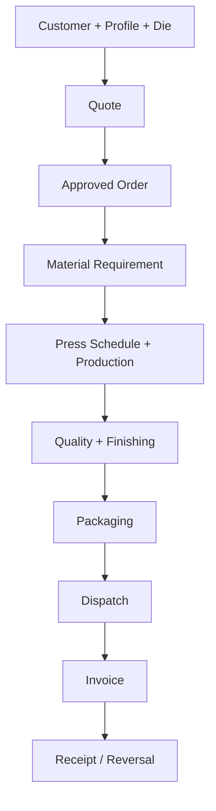

# ExtrusionOS Practical Workflow and Module Audit

Date: 2026-07-22
Repository: `ArnavJ19/ExtrusionOS`
Method: three role-based human walkthroughs (commercial/planning, factory/quality/dispatch, owner/admin) coordinated with developer review, source inspection, and the full automated baseline.

## Executive conclusion

ExtrusionOS is a substantial ERP/MES codebase, not a presentation-only prototype. It has tenant isolation, guarded actions, detailed extrusion domain fields, financial ledgers, revision concepts, and broad automated coverage. The practical problem is consistency: several screens independently make the same business decision, some later modules infer facts that an earlier module never captured, and legacy and canonical workflows coexist.

The system should be treated as a connected record chain, not a collection of menu pages:

Each arrow is a business contract. The downstream module must consume an identified upstream record and must not recreate or guess its data. Dashboards, search, reports, analytics, alerts, and audit are observers of this chain; they must never become alternative sources of truth.

## Why each module exists and why it is connected

| Module | User decision it owns | Authoritative input | Required output / next handoff | Why the connection exists |
|---|---|---|---|---|
| Customers / CRM | Who is buying, where it ships, and which commercial relationship applies | Verified customer identity, GST, contacts, billing and shipping locations | Customer ID used by quotes, orders, invoices, documents and follow-up | Names copied as text cannot reliably support tax, credit, delivery, or customer history |
| Profiles | What cross-section is being sold and manufactured | Drawing, alloy/temper, kg/m, tolerances, packing standard | Versioned profile reference for quote and production lines | Commercial weight, die compatibility, billet need, QC tolerance, and packing all depend on one section definition |
| Dies | Which physical tool can produce a profile | Profile link, die number, status, correction/trial history | A usable die selection for the production job | A profile is a design; a die is the actual production capability. Dead or mismatched dies must block release |
| Quotes | What the business is offering and at what margin | Customer, profile/die lines, weight math, processing, charges, approval | Customer-approved, revision-locked commercial lines | Order creation must preserve exactly what was approved, not reconstruct it from current master data |
| Orders | What the business has committed to deliver | One approved quote/revision plus dispatch date, priority and fulfilment split | Immutable demand lines and manufacturing/dealer-stock requirements | Planning, stock reservation, dispatch, invoicing and delivery promises all need one commitment record |
| Foundry / Billets | Which physical input exists and is available for extrusion | Furnace/receipt source, chemistry, diameter, actual billet identity and weight | Allocated and then issued billets linked to an order requirement and production job | Recovery and genealogy are impossible if input material is generated or selected only by an estimated count |
| Inventory | Where physical material is, who owns it, and whether it is free, reserved or consumed | Posted receipts, production outputs, adjustments and reversals | Traceable stock balance and transactions used by planning and fulfilment | A generic editable quantity cannot safely stand in for billet, WIP, finished profile, dealer stock and packaging material states |
| Production Planning | Which eligible job will use which press and time window | Open order demand, usable die, available press, allocated input | One non-overlapping active press slot per job | The plan coordinates scarce equipment. Duplicate jobs or overlapping slots make dates and capacity meaningless |
| Production | What was actually issued, run, produced, rejected and scrapped | Released schedule slot, exact job, exact billets | Actual output with pieces/metres/kg and job-linked mass balance | QC, recovery, packaging availability and cost depend on actual—not planned—output |
| Quality | Whether a measured quantity is accepted, quarantined, reworked, conceded or scrapped | Identified production/finishing output and specification revision | Quantity-level disposition and evidence | “Rejected” is not an operational end state; material must have a controlled next location and decision |
| Finishing | Which accepted or controlled extrusion output receives which process | Production output, required finish, recipe/vendor route | Actual finished output, loss, status and evidence | Packing and dispatch must use the correct finish, not merely a profile code |
| Packaging | What exact quantity was packed into which physical bundles | QC-approved mill/finished output and packaging material | Bundle IDs with actual pieces, net/gross weight and source lineage | Dispatch, customer claims and stock decrement operate on physical bundles, not an evenly divided estimate |
| Dispatch | Which physical bundles left, on which vehicle, under which proof | Ready packages selected by the dispatcher | Immutable manifest, logistics status, delivery proof and stock movement | A dispatch header cannot prove what left the factory. The manifest must be captured, not fabricated |
| Invoices / Receivables | What legally billable quantity/value is due | Approved dispatch/order lines and tax identity | Issued invoice, balance, due date, credit/debit adjustments | Bookings are not revenue and dispatch weight is not automatically the invoiced commercial quantity |
| Receipts / Payments | Which posted event changed an invoice balance | Invoice and real payment/credit/refund event | Append-only settlement/reversal ledger | Cash KPIs must not sum cancelled payments or treat non-cash credit notes as receipts |
| Expenses / Vendors | What the company spent and with whom | Vendor and approved expense evidence | Categorised payable/cash event and audit trail | This supports profitability but is not a substitute for a PO → receipt → payable procurement workflow |
| Dashboard / Command Center | What this role must act on now | Permission-filtered canonical records | Links to exact records and transparent KPI definitions | A dashboard is an operational lens. It must not expose commercial data to floor roles or invent missing measures |
| Search | Find an accessible record quickly | Role-allowed resources only | Direct link to the exact record | Search is an authorization surface, not merely a convenience feature |
| Reports / Analytics | Explain what happened without changing it | Posted, lineage-complete business records | Reproducible aggregates with definition and completeness state | Sorting is not grouping, and missing input must be reported as missing rather than estimated |
| Settings / Access / Audit | Define who can do what and prove what changed | One role/permission model, feature controls and immutable events | Consistent navigation, route/API enforcement, invites, and audit | Duplicate invitation, role and feature systems create security behavior the owner cannot predict |

## Changes implemented in this review

| Problem | Practical correction | Resulting contract |
|---|---|---|
| Inactive users bounced forever between Dashboard and Onboarding | Added a stable suspended-access page and enforced it in middleware and session loading | Deactivated users can only understand the state and sign out; they cannot enter company workflows |
| Production/dispatch/quality/inventory roles landed on an owner commercial dashboard | Made dashboard queries, views and default tab role-aware | Operational roles do not query or render quote pipeline, bookings or customer-value KPIs |
| Global search queried resources the role could not use and returned overview links | Permission-filtered each resource and linked exact customer/profile/die/quote/order/dispatch records | Search results follow the same resource permissions as the application |
| Mobile links exposed irrelevant role destinations | Added role-filtered mobile destinations and page-level route checks | Floor users see only jobs, scan, dispatch, quality or tasks they can actually open |
| Factory/inventory roles had permissions but missing navigation | Added discoverable navigation where the route permission exists | Authorized work is no longer hidden behind guessed URLs |
| Quote detail/list could immediately create an order with silent defaults | Routed conversion through `/orders/new?quoteId=...` | Every conversion reviews dispatch date, priority, dealer stock and the 700 kg factory minimum using the canonical transaction |
| A job could receive duplicate slots, presses could overlap, and release could target the wrong slot | Added database serialization/conflict checks and atomic schedule/release RPCs; release uses exact slot ID | One active slot per job, no active overlap per press, complete start/end, atomic job+slot update |
| Core data export always failed on nonexistent `purchase_orders` | Removed the unsupported standalone export and isolated table failures with a manifest | A backup contains successful/skipped/error tables and no optional module aborts the whole file |
| Enterprise settings presented a second, non-onboarding invitation form | Removed the legacy invite form and routed to `/settings/access` | Owners use one tokenized invitation lifecycle |
| Command Center used UTC calendar dates for an India business | Added Asia/Kolkata-default business boundaries | Day/month queries agree around midnight, month-end and year-end |
| Command Center summed every payment row as cash | Switched to canonical financial collection events | Cancelled/reversed/non-cash events follow ledger semantics |
| Recovery inferred input as output + scrap | Uses issued/consumed billets linked to completed jobs and shows “Not captured” for incomplete lineage | Recovery is only stated when physical input is present |
| Invoices were missing beside Payments | Added a separate Invoices/Receivables navigation entry | Billing and cash collection are discoverable as different workflows |

## Remaining deployment blockers

These are not cosmetic backlog items. They can create incorrect stock, genealogy, quality disposition or financial decisions and should block an unrestricted production rollout.

### P0 — physical dispatch manifest is inferred

The new-dispatch flow captures header totals, while server logic FIFO-selects ready sources and evenly distributes net kg/pieces into “physical” bundle rows. A generated allocation must not be labelled as an observed physical manifest.

Required acceptance:

- Dispatcher scans/selects actual package or bundle IDs.
- Each bundle already has measured pieces, net/gross/tare weight, finish and source output.
- The transaction locks selected bundles, rejects already-used/quarantined stock, and posts exact stock movement atomically.
- Manifest correction is a controlled reversal/replacement, never an edit that erases history.

### P0 — production job and billet edits do not fully reconcile

Saving an edited production job assigns selected billets but does not reliably release billets removed from the selection. Job creation can also plan the same order/profile demand more than once because source-line selection is ambiguous and planned quantity is not capped against the specific order line.

Required acceptance:

- A production job references one exact order-line ID.
- Remaining demand is locked and calculated inside the save transaction.
- Billet changes are a diff: newly selected billets are issued; omitted, unconsumed billets are explicitly released.
- Alloy, diameter, order requirement and profile/die compatibility are checked in the same transaction.
- Completed/consumed material can only be corrected by reversal.

### P0 — rejected and rework quality has no complete disposition chain

Quality can record rejected/rework status but lacks a complete NCR/quarantine/concession/scrap/rework loop tied to quantities and a corrected inspection.

Required acceptance:

- Every non-approved quantity enters a quarantine location/state.
- NCR records cause, owner, evidence and disposition.
- Rework produces a linked work instruction and subsequent inspection.
- Concession requires authorized customer/internal approval.
- Scrap posts an irreversible consumption event, with reversal by a compensating record only.

### P0 — packaging is a full-job boolean rather than physical output

Packaging can be scheduled/consumed at the wrong lifecycle point and does not consistently represent partial approved quantities, exact bundle weights or source lineage.

Required acceptance:

- Only available QC-approved quantity can be packed.
- Partial packing reserves/consumes only its actual source quantity.
- Packaging material is reserved at planning and consumed on completion/cancellation reconciliation.
- Every bundle receives a stable ID and measured facts used directly by dispatch.

### P0 — inventory has competing meanings

The generic Inventory register is not the operational source used by billet, profile-stock and packaging workflows. Users can reasonably believe its balance is the factory truth when the real state lives elsewhere.

Required acceptance:

- Define one stock ledger with item, lot/bundle, owner, location and state dimensions.
- Billet, WIP, finished profile, dealer stock and packaging views become projections of posted transactions.
- Opening, receipt, issue, transfer, adjustment, reservation, consumption and reversal use reasoned transactions.
- Remove any editable balance that is not ledger-derived, or label it explicitly as a non-operational catalog.

### P0 — dealer/commercial boundary needs explicit design

Dealer portal routes redirect into internal quote/order surfaces, and row-level security cannot hide internal cost/margin columns within an allowed quote row. The product language alternates between “Customer Portal” and “Dealer Portal.”

Required acceptance:

- Decide whether the external actor is a dealer, customer, or both and model identities separately.
- External pages use dedicated safe views/RPCs that expose approved selling data only.
- Internal quote edit, approval, cost and margin fields are not reachable from an external role.
- Portal feature disabling blocks navigation, direct pages and APIs for existing sessions.

## High-priority structural gaps

- Custom roles can be created and invited, but middleware, UI permission checks and navigation still depend on a fixed role union. Either remove custom role creation or make effective permissions authoritative everywhere.
- Settings feature toggles and enterprise feature flags are separate systems. One control must govern navigation, routes, APIs and jobs.
- Foundry billet counts can be generated from fixed diameter assumptions and reduced counts are not fully reconciled. Physical billet identity/weight must come from observed production or receipt.
- Packaging material is consumed too early, and production/packaging are not partial-quantity aware.
- Cancellation/correction/reversal behavior is not uniform across operational modules.
- Lookup controls that preload 250 records fail silently at real enterprise scale; use tenant-scoped server search and pagination.
- Report Builder “Grouping” behaves as sorting. True aggregates need group keys, measures, totals and exported parity.
- Notifications count and recipient visibility disagree; broadcasts need per-user read receipts.
- Generic inventory and vendor modules imply procurement capability, but no complete PO → receipt → three-way-match chain exists.
- Order detail does not yet provide a complete linked timeline across production, QC, finishing, packaging, dispatch, invoice and receipt.

## Recommended implementation order

1. Build physical package/bundle identity and QC-approved quantity availability.
2. Replace dispatch inference with scan/select manifest capture.
3. Make production demand and billet reassignment line-specific and atomic.
4. Add NCR/quarantine/rework/concession/scrap disposition.
5. Consolidate operational stock into a transaction-ledger model.
6. Separate external dealer/customer surfaces from internal commercial screens.
7. Consolidate roles, feature controls, invitations and notification visibility.
8. Add end-to-end browser/database scenarios after each chain is complete.

## Verification strategy required for release

Static and unit tests are necessary but cannot validate a factory workflow on their own. Each critical chain needs seeded, tenant-isolated browser/database tests:

- Two planners race to assign the same press and job; exactly one transaction succeeds.
- A quote below/above factory minimum converts only through the reviewed form and preserves every source line.
- A production edit removes one unconsumed billet and it becomes available exactly once.
- Partial output is QC-approved, partially packed, dispatched by scanned bundle, invoiced, received and then reversed through compensating events.
- Rejected material cannot be packed or dispatched until an authorized disposition and passed reinspection.
- Dealer, floor, quality, dispatch, accounts and inactive users are each denied data and actions outside their role.
- Dashboard/report totals reconcile to the canonical ledgers at 00:01 IST, month-end and year-end.
- Export with one unavailable optional module still downloads and identifies the omission.

Until the five P0 physical/data-lineage blockers above are closed and these scenarios pass against a real Supabase environment, ExtrusionOS should be piloted with controlled data and supervision rather than declared unrestricted production-ready.
